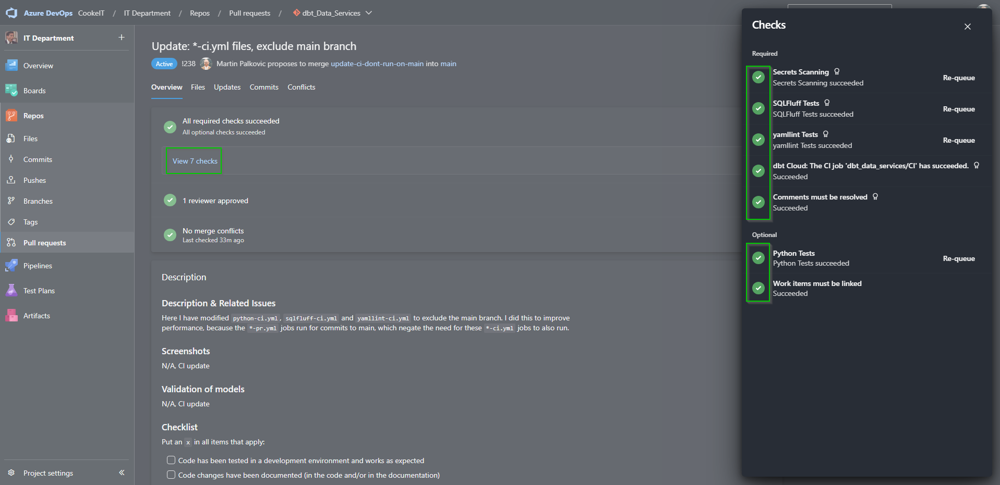

# Cooke Inc dbt Data Services Repository

## Overview

This repository contains Cooke Aquaculture Inc's dbt models that transform raw Snowflake data into curated datasets used by various business units for reporting, analytics, reverse ETL processes, and data science applications.

**dbt Administrator:** Analytics Engineering Team

[](https://dev.azure.com/CookeIT/IT%20Department/_build/latest?definitionId=24&branchName=main)
[](https://dev.azure.com/CookeIT/IT%20Department/_build/latest?definitionId=25&branchName=main)
[](https://dev.azure.com/CookeIT/IT%20Department/_build/latest?definitionId=27&branchName=main)

[](https://dev.azure.com/CookeIT/77553833-8135-4a65-8f68-79cc3e8f81d4/_boards/board/t/7297661c-ee37-4e91-b543-b0a5c00871c8/Issues/)

---

## Table of Contents

- [Project Architecture](#project-architecture)
- [Prerequisites](#prerequisites)
- [Getting Started](#getting-started)
  - [dbt Cloud Setup](#dbt-cloud-setup)
  - [Local Development Setup](#local-development-setup)
- [Project Structure](#project-structure)
- [Configuration](#configuration)
- [Development Workflow](#development-workflow)
- [Testing & Quality Assurance](#testing--quality-assurance)
  - [SQLFluff Setup](#sqlfluff-setup)
  - [yamllint Setup](#yamllint-setup)
- [CI/CD Pipeline](#cicd-pipeline)
- [Common dbt Commands](#common-dbt-commands)
- [Data Domains](#data-domains)
- [Deployment](#deployment)
- [Troubleshooting](#troubleshooting)
- [Contributing](#contributing)
- [Additional Resources](#additional-resources)
- [Frequently Asked Questions](#frequently-asked-questions)

---

<div id='project-architecture'/>

## Project Architecture

This dbt project follows a **layered architecture** pattern with three main layers:

### 1. **Staging Layer** (`models/staging/`)
- **Purpose:** Clean and standardize raw source data
- **Materialization:** Views (fast, always up-to-date)
- **Conventions:**
  - Models prefixed with `stg_`
  - One model per source table/view
  - Basic data cleaning (nulls, data types, renaming)
  - Sources defined in `_sources.yml` files

### 2. **Intermediate Layer** (`models/intermediate/`)
- **Purpose:** Business logic transformations, reusable building blocks
- **Materialization:** Views (generally), tables for complex aggregations
- **Conventions:**
  - Models prefixed with `int_`
  - Combine multiple staging models
  - Reusable transformations (e.g., currency conversion, date calculations)

### 3. **Marts Layer** (`models/marts/`)
- **Purpose:** Business-ready datasets for end users
- **Materialization:** Tables (for performance), views (for real-time needs)
- **Organized by domain:**
  - `finance/` - Financial reporting, AP/AR, spend analysis
  - `global_sales/` - Sales reporting and analytics
  - `global_inventory/` - Inventory management and tracking
  - `it/` - IT operations, Snowflake usage, system metrics
  - `ancillary/` - Supporting business functions
  - And more...

### Data Flow
```
Raw Sources (Snowflake) → Staging → Intermediate → Marts → BI Tools
```

---

<div id='prerequisites'/>

## Prerequisites

### Required:
- **dbt Account:** dbt Cloud account or dbt Core CLI installed
- **Azure DevOps Account:** For version control and CI/CD
- **Snowflake Access:** Personal Snowflake account with appropriate permissions
- **Git:** Version control ([Download](https://git-scm.com/downloads))
- **Code Editor:** Visual Studio Code IDE / dbt Cloud IDE / cursor IDE
- **SQLFluff:** SQL linter (installation instructions below)
- **yamllint:** YAML linter (installation instructions below)

### Recommended:
- **Python 3.8+:** For local development and SQLFluff
- **dbt Power User Extension:** VS Code extension for dbt development

**Please contact the dbt administrator (Analytics Engineering Team) if you need access to dbt Cloud or Azure DevOps**

---

<div id='getting-started'/>

## Getting Started

### dbt Cloud Setup

**This setup guide covers [dbt Cloud](https://www.getdbt.com/product/what-is-dbt/). Note that you can use this repository with the [dbt Core](https://github.com/dbt-labs/dbt-core) CLI, however dbt Core setup is not covered in this documentation**

#### Steps:
1. **Request Access:** Request a dbt login from the dbt administrator
2. **Sign In:** Navigate to the [dbt website](https://cloud.getdbt.com/login/), enter your credentials and sign in
3. **Configure Profile:** 
   - Click **Settings** (Gear icon in upper righthand corner)
   - Choose **Profile Settings**
   - Under **Credentials**, choose `dbt_data_services` and click **Edit**
   - Enter your Snowflake username and password
   - Connection should be set to `yj63875.canada-central.azure`
   - Use your **personal account**, not a service account
   - Click **Save**
4. **Start Developing:** Click `Develop` in the upper left-hand corner and begin coding!


### Local Development Setup

For local development with dbt Core:

1. **Install dbt Core:**
   ```bash
   pip install dbt-core dbt-snowflake
   ```

2. **Install Dependencies:**
   ```bash
   dbt deps
   ```
   Note: If you encounter SSL errors in a corporate environment, you may need to configure SSL certificates or use `$env:PYTHONHTTPSVERIFY = "0"` temporarily.

3. **Configure Profile:**
   Create/edit `~/.dbt/profiles.yml` (or use `config/dbt/profiles.yml.example` as a template):
   ```yaml
   default:
     target: dev
     outputs:
       dev:
         type: snowflake
         account: yj63875.canada-central.azure
         user: <your-email>
         authenticator: externalbrowser
         database: cooke_datahub_dev
         warehouse: reporting_wh
         schema: dbt_<your-username>
         role: ANALYTICS_ENGINEER
         threads: 4
   ```

4. **Test Connection:**
   ```bash
   dbt debug
   ```

5. **Install Project Dependencies:**
   ```bash
   dbt deps
   ```

---

<div id='project-structure'/>

## Project Structure

```
dbt_Data_Services/
├── .azuredevops/          # CI/CD pipeline configurations
│   └── workflows/        # Azure Pipeline workflows
├── analyses/             # Ad-hoc analyses (not compiled to warehouse)
├── assets/               # Images and documentation assets
├── config/               # Configuration files
│   └── dbt/             # dbt configuration files and templates
│       ├── profiles.yml  # Example profiles.yml (template)
├── dbt_pkgs/         # Installed dbt packages (gitignored)
├── dbt_internal_packages/ # Internal dbt adapters (gitignored)
├── macros/               # Reusable SQL macros and functions
│   ├── finance/         # Financial calculation macros
│   ├── global_inventory/ # Inventory-related macros
│   ├── global_sales/     # Sales-related macros
│   └── ...
├── models/               # dbt models (core of the project)
│   ├── staging/          # Raw data cleaning layer
│   ├── intermediate/     # Transformation layer
│   ├── marts/            # Business-ready datasets
│   └── de_views/         # Data Engineering views
├── seeds/                # CSV seed files for reference data
├── snapshots/            # Snapshot configurations for SCD Type 2
├── tests/                # Custom dbt tests
├── dbt_project.yml       # Main dbt project configuration (required at root)
├── packages.yml          # dbt package dependencies (conventionally at root)
├── package-lock.yml      # dbt package lock file (conventionally at root)
├── selectors.yml         # Model selection definitions (conventionally at root)
├── requirements.txt      # Python dependencies
├── .gitignore           # Git ignore patterns
└── README.md            # This file
```

---

<div id='configuration'/>

## Configuration

### Project Configuration (`dbt_project.yml`)

The project is named `cookedbt` and configured with:
- **Profile:** `default` (from `~/.dbt/profiles.yml`)
- **Target:** `dev` (development environment)
- **Materializations:**
  - Staging models: Views (fast, always current)
  - Intermediate models: Mostly views
  - Marts: Tables (for performance) or views (for real-time)

### Package Dependencies (`packages.yml`)

This project uses the following dbt packages:
- `dbt-labs/dbt_utils` (v1.3.1) - Utility macros and helpers
- `dbt-labs/codegen` (v0.12.0) - Code generation utilities
- `dbt-labs/audit_helper` (v0.9.0) - Data quality and audit utilities

Install packages with:
```bash
dbt deps
```

### Model Selectors (`selectors.yml`)

Predefined selectors for common refresh schedules:
- `refresh_10m` - Models refreshed every 10 minutes
- `refresh_1h` - Models refreshed every hour
- `refresh_4h` - Models refreshed every 4 hours

Usage:
```bash
dbt build --selector refresh_1h
```

---

<div id='development-workflow'/>

## Development Workflow

### 1. **Create a Branch**
```bash
git checkout -b feature-my-new-model
```

Branch naming convention:
- `feature-<domain>-<description>`
- `bug-<domain>-<fix-description>`
- `update-<description>`

### 2. **Develop Your Models**
- Create models in the appropriate layer (staging → intermediate → marts)
- Add documentation in `_models.yml` files
- Add tests for data quality

### 3. **Test Locally**
```bash
# Run specific model
dbt run --select my_model

# Run model and its tests
dbt build --select my_model

# Check for linting issues
sqlfluff lint models/my_model.sql --dialect snowflake
```

### 4. **Commit and Push**
```bash
git add .
git commit -m "Feature: Add new sales model"
git push origin feature-my-new-model
```

### 5. **Create Pull Request**
- Use the PR template (auto-populated in Azure DevOps)
- Ensure all CI checks pass
- Get code review approval
- Merge to main

---

<div id='testing--quality-assurance'/>

## Testing & Quality Assurance

### SQLFluff

[SQLFluff](https://docs.sqlfluff.com/en/stable/index.html) is a SQL linter that checks syntax, formatting, and style. It runs automatically on every push to Azure DevOps.

<div id='sqlfluff-setup'/>

#### SQLFluff Setup

1. **Install Python** from Microsoft Store (Python 3.8+ recommended)

2. **Install SQLFluff:**
   ```bash
   pip install sqlfluff
   ```

3. **Add to PATH:**
   - If SQLFluff is not recognized, add `Python38\Scripts` to your system PATH
   - Environment Variables → System Variables → PATH → Edit → New
   - Add: `C:\Users\<username>\AppData\Local\Packages\...\Python38\Scripts`

4. **Verify Installation:**
   ```bash
   sqlfluff version
   ```

#### SQLFluff Usage

**Lint a file:**
```bash
sqlfluff lint models/my_model.sql --dialect snowflake
```

**Auto-fix issues:**
```bash
sqlfluff fix models/my_model.sql --dialect snowflake
```

**Important Notes:**
- SQLFluff currently ignores custom Jinja templating (`ignore = templating`)
- This means dbt-utils macros are not linted
- Configuration in `.sqlfluff` can be modified via PR

### yamllint

[yamllint](https://yamllint.readthedocs.io/en/stable/) checks YAML file syntax and formatting.

<div id='yamllint-setup'/>

#### yamllint Setup

```bash
pip install yamllint
```

**Usage:**
```bash
# Lint a file
yamllint dbt_project.yml

# Lint all YAML files in current directory
yamllint .
```

**Note:** yamllint runs on all YAML files during Pull Requests to catch syntax issues early.

### dbt Tests

Add tests to models in `_models.yml` files:

```yaml
models:
  - name: my_model
    columns:
      - name: id
        tests:
          - not_null
          - unique
      - name: amount
        tests:
          - not_null
          - dbt_utils.accepted_range:
              min_value: 0
```

Run tests:
```bash
dbt test --select my_model
```

---

<div id='cicd-pipeline'/>

## CI/CD Pipeline

Azure DevOps pipelines automatically run on every push and PR:

### On Push (Branch):
- **SQLFluff:** Lints new/changed `.sql` files
- **yamllint:** Lints new/changed `.yml` files
- **Python Tests:** Runs Python unit tests (if applicable)
- **Secret Scanning:** Checks for exposed secrets

### On Pull Request:
- **SQLFluff:** Lints ALL `.sql` files in repository
- **yamllint:** Lints ALL `.yml` files in repository
- **dbt Build:** Runs `dbt build` on changed models (via dbt Cloud webhook)

### Pipeline Files:
- `.azuredevops/workflows/sqlfluff-ci.yml` - SQLFluff on changed files
- `.azuredevops/workflows/sqlfluff-full.yml` - SQLFluff on all files (PRs)
- `.azuredevops/workflows/yamllint-ci.yml` - yamllint on changed files
- `.azuredevops/workflows/dbt-deploy.yml` - Deployment automation

---

<div id='common-dbt-commands'/>

## Common dbt Commands

### Development Commands
```bash
# Compile models (check syntax)
dbt compile

# Run specific models
dbt run --select my_model
dbt run --select staging.*
dbt run --select +my_model  # model and all upstream

# Run tests
dbt test --select my_model

# Build (run + test)
dbt build --select my_model

# Generate documentation
dbt docs generate
dbt docs serve  # View at http://localhost:8080

# List models
dbt ls
dbt ls --resource-type model
dbt ls --select staging.*

# Debug connection
dbt debug
```

### Package Management
```bash
# Install packages
dbt deps

# Update lock file
dbt deps --upgrade
```

### Selection Syntax
```bash
# By path
dbt run --select staging.*

# By tag
dbt run --select tag:refresh_1h

# By selector
dbt run --selector refresh_1h

# Multiple criteria
dbt run --select staging.* tag:finance
```

---

<div id='data-domains'/>

## Data Domains

This repository covers multiple business domains:

### Finance
- **Accounts Payable:** Vendor invoices, aging analysis
- **Accounts Receivable:** Customer invoices, collections
- **Spend Analysis:** Vendor spend tracking
- **Donations:** Corporate donation tracking
- **Financial Reporting:** P&L, balance sheet data

### Global Sales
- **Sales Transactions:** Order-level sales data
- **Customer Analytics:** Customer segmentation and behavior
- **Product Sales:** Product-level performance
- **Regional Sales:** Geographic sales breakdowns

### Global Inventory
- **Inventory Tracking:** Stock levels, movements
- **Standard Units:** Unit conversions
- **Inventory Valuation:** Cost basis calculations

### Corporate Performance Management (CPM)
- **Fishtalk:** Operational reporting
- **SAP Integration:** European operations data
- **Financial Planning:** Budget and forecast data

### IT Operations
- **Snowflake Usage:** Warehouse and query metrics
- **Power BI Usage:** Usage analytics
- **System Monitoring:** Infrastructure metrics

### Other Domains
- **EDI (Electronic Data Interchange):** Transaction data
- **Concur:** Expense management
- **SharePoint:** Document and form data
- **Quality Assurance (QA):** Quality control forms and data
- **Saltwater Operations:** Farming and biological inventory
- **And more...**

---

<div id='deployment'/>

## Deployment

### Development Environment
- **Target:** `dev`
- **Database:** `cooke_datahub_dev`
- **Schema:** Personal schemas (`dbt_<username>`)
- **Access:** All developers

### Production Environment
- **Deployment:** Automated via dbt Cloud and Azure DevOps
- **Process:**
  1. PR merged to `main` branch
  2. dbt Cloud job triggers automatically (via webhook)
  3. Models built in production Snowflake
  4. Tests run to validate deployment

### Deployment Best Practices
- ✅ Test in development first
- ✅ Run `dbt build` on affected models
- ✅ Review lineage graph for downstream impacts
- ✅ Don't deploy on Fridays (weekend risk)
- ✅ Have rollback plan ready

---

<div id='troubleshooting'/>

## Troubleshooting

### Common Issues

#### "No profile specified"
- **Solution:** Ensure `profile: "default"` exists in `dbt_project.yml` and `~/.dbt/profiles.yml` has a `default` profile

#### "Package installation fails with SSL error"
- **Solution:** Corporate firewall may block GitHub. Try:
  ```powershell
  $env:PYTHONHTTPSVERIFY = "0"
  dbt deps
  ```
  Note: Work with IT for permanent SSL certificate solution

#### "Model not found in project"
- **Solution:** 
  - Check model file is in correct directory
  - Verify `dbt_project.yml` includes the model path
  - Run `dbt clean` and `dbt deps`

#### "Permission denied" in Snowflake
- **Solution:** Verify your Snowflake role has necessary grants:
  - `USAGE` on database and schema
  - `SELECT` on source tables
  - `CREATE` on target schema

#### SQLFluff not recognized
- **Solution:** Add Python Scripts to system PATH (see SQLFluff Setup section)

---

<div id='contributing'/>

## Contributing

The main branch is protected - **Pull Requests (PRs) are required** for all changes.

### PR Requirements

**Required:**
- ✅ Passing SQLFluff CI check
- ✅ Passing yamllint CI check
- ✅ Code review approval from team member
- ✅ All PR comments resolved

**Recommended:**
- ✅ Passing dbt CI test (runs automatically via webhook)
- ✅ Code coverage analysis
- ✅ Documentation updated

### Contribution Guidelines

**Branch Naming:**
- `feature-<domain>-<description>` - New functionality
- `bug-<domain>-<fix-description>` - Bug fixes
- `update-<description>` - Updates to existing code

**PR Naming:**
- Follow same convention as branch names
- Be descriptive: `Feature: Add donations tracking model`
- Reference tickets/tasks when applicable

**Code Style:**
- Follow [dbt Labs style guide](https://github.com/dbt-labs/corp/blob/main/dbt_style_guide.md)
- Use underscores in column names: `my_column` not `mycolumn`
- Encase code references in backticks in documentation
- Remove commented-out code (Git history preserves old versions)

**Best Practices:**
- Keep PRs small and focused
- Test locally before pushing
- Include documentation in PR description
- Use appropriate materializations (views vs. tables)
- Add tests for data quality
- Don't merge on Fridays

**PR Template:**
Use the provided template at `.azuredevops/pull_request_template.md` which includes:
- Description and related issues
- Screenshots of lineage
- Validation of models
- Checklist
- Deployment notes
- Rollback plan

---

<div id='additional-resources'/>

## Additional Resources

### dbt Resources
- [Awesome dbt GitHub repository](https://github.com/Hiflylabs/awesome-dbt/tree/main) - Comprehensive dbt resources
- [dbt Labs: How we structure our dbt projects](https://docs.getdbt.com/guides/best-practices/how-we-structure/1-guide-overview)
- [dbt Labs: How we style our dbt projects](https://docs.getdbt.com/guides/best-practices/how-we-style/0-how-we-style-our-dbt-projects)
- [dbt style guide](https://github.com/dbt-labs/corp/blob/main/dbt_style_guide.md)
- [dbt Cloud environment best practices](https://docs.getdbt.com/guides/best-practices/environment-setup/1-env-guide-overview)
- [dbt materialization best practices](https://docs.getdbt.com/guides/best-practices/materializations/1-guide-overview)
- [dbt Python models](https://docs.getdbt.com/docs/build/python-models)
- [dbt best practices, legacy](https://docs.getdbt.com/guides/legacy/best-practices)

### Linting & Quality
- [SQLFluff Documentation](https://docs.sqlfluff.com/en/stable/index.html)
- [yamllint Documentation](https://yamllint.readthedocs.io/en/stable/)

### Git & Markdown
- [Getting started with Markdown](https://www.markdownguide.org/getting-started/)
- [Basic Markdown Syntax](https://docs.github.com/en/get-started/writing-on-github/getting-started-with-writing-and-formatting-on-github/basic-writing-and-formatting-syntax)

### Advanced Topics
- [Unioning identically-structured data sources in dbt](https://discourse.getdbt.com/t/unioning-identically-structured-data-sources/921)
- [Run a dbt Cloud job on merge](https://docs.getdbt.com/guides/orchestration/custom-cicd-pipelines/3-dbt-cloud-job-on-merge)

---

<div id='frequently-asked-questions'/>

## Frequently Asked Questions

**Why is it called a 'Pull Request'? Wouldn't it make more sense to call it a 'push' request?**
- You are making a request for the maintainers to `pull` your changes into the production branch. The term originates from open source software development.

**Who should I contact for dbt support issues?**
- For basic issues, contact the Analytics Engineering Team. For complex issues, email <support@getdbt.com> or chat with dbt support through the cloud UI:


**I have no familiarity with the code I've been asked to review. What should I do?**
- Focus on:
  - ✅ Confirm all CI checks are passing (especially dbt Slim CI)
  - ✅ Confirm `dbt build -s <models_in_pr>` runs successfully
  - ✅ Confirm code adheres to SQL style best practices
  - ✅ Check that tests exist and pass

Click `View checks` in the PR to see CI status:



**How do I know what models are affected by my changes?**
- Run `dbt ls --select +my_model` to see downstream models
- Use `dbt docs generate` and view the lineage graph
- Check `dbt list` output for model dependencies

**What's the difference between staging, intermediate, and marts?**
- **Staging:** One-to-one with source tables, basic cleaning
- **Intermediate:** Business logic, reusable transformations
- **Marts:** Final datasets for end users, organized by domain

**How do I add a new data source?**
1. Create source definition in `models/staging/<domain>/_<domain>__sources.yml`
2. Create staging model(s) in `models/staging/<domain>/`
3. Add documentation and tests
4. Build intermediate/marts models as needed

**Can I use Python models?**
- Python models are supported but currently flagged in dbt-fusion. Use SQL models when possible.

**How often are models refreshed?**
- Check model tags in `dbt_project.yml` or use selectors:
  - `refresh_10m` - Every 10 minutes
  - `refresh_1h` - Every hour  
  - `refresh_4h` - Every 4 hours
  - No tag - Manual or scheduled refresh

**What if I need to rollback a change?**
- Create a new PR reverting the changes
- Or restore from git history if recent
- Communicate with affected stakeholders

---

## Support & Contact

- **dbt Administrator:** Analytics Engineering Team ([DataAnalytics@cookeaqua.com](mailto:DataAnalytics@cookeaqua.com))
- **Repository:** [Azure DevOps dbt_Data_Services](https://dev.azure.com/CookeIT/IT%20Department/_git/dbt_Data_Services)
- **dbt Cloud:** [https://lx848.us1.dbt.com/](https://lx848.us1.dbt.com/)

---

**Maintain a single source of truth by only working on production Snowflake code inside of this repository. The main branch of this repo should always reflect what is in the Snowflake production environment.**

**Suggest updates to this documentation in a PR!**
